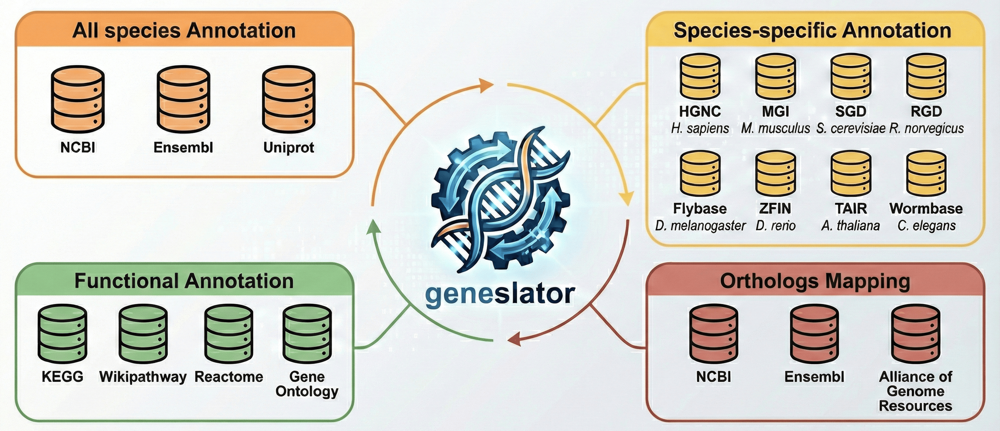

# geneslator 

<!-- badges: start -->
[](https://app.codecov.io/gh/knowmics-lab/geneslator?branch=main)
[](https://opensource.org/licenses/Artistic-2.0)
<!-- badges: end -->

**geneslator** is a comprehensive R package for gene identifier conversion and genome annotation across multiple model organisms. The package integrates data from several cross-organism databases and organism-specific resources within a single, coherent framework. Key features are:

- **Multiple database integration**: Integrates data from cross-organism databases (NCBI, Ensembl, UniProt, Alliance of Genome Resources, GO, KEGG, Reactome, Wikipathways) and organism-specific resources (HGNC, MGI, RGD, SGD, WormBase, Flybase, ZFIN, TAIR)
- **Archive search**: Supports searching using both current and archived gene identifiers in NCBI and Ensembl databases
- **Alias resolution**: Supports automatic disambiguation between symbols and aliases in annotations involving gene symbols
- **Automatic download**: Annotation databases are automatically downloaded when needed and cached locally
- **Version management**: Independent versioning system for databases with automatic update checks

Four different types of data about a gene are integrated: annotations from general databases (symbol, aliases, full name, genetype), annotations from species-specific databases, functional annotations (pathways and gene ontologies), and orthologs.



## Supported organisms

Currently, annotation databases have been built for the following organisms:

- *Homo sapiens* (Human)
- *Mus musculus* (Mouse)
- *Rattus norvegicus* (Rat)
- *Danio rerio* (Zebrafish)
- *Drosophila melanogaster* (Fly)
- *Caenorhabditis elegans* (Worm)
- *Saccharomyces cerevisiae* (Yeast)
- *Arabidopsis thaliana* (Arabidopsis)
- *Brassica oleracea* (Cabbage)
- *Brassica napus* (Rapeseed)
- *Solanum lycopersicum* (Tomato)
- *Vitis vinifera* (Grapevine)
- *Lupinus angustifolius* (Blue lupin)
- *Phaseolus vulgaris* (Common bean)

More organisms will be included in future releases of **geneslator**.

## Data sources

General information about a gene (symbol, aliases, full name, and genetype) are extracted from NCBI Gene and Ensembl. Genetype represents the biotype classification of a gene (e.g., “protein-coding gene”, “non-coding RNA”, “pseudogene”, “lncRNA”). Where available, locus tag identifiers are also included as gene information.

Identifiers of a gene include Entrez GeneIDs (taken from NCBI), Ensembl GeneIDs (taken from NCBI and Ensembl), Uniprot IDs of its proteins (taken from Uniprot). For species in which Ensembl GeneIDs are generated from Ensembl native annotations (through Ensembl Genebuild) and do not originate from species-specific resources, gene identifiers include species-specific identifiers, coming from the most popular model organism databases, such as HGNC for Human, MGI for Mouse, RGD for Rat, SGD for Yeast and ZFIN for Zebrafish. For Zebrafish, we also collect Ensembl GeneID and Gene symbols data from HCOP. 

**geneslator** annotation databases also integrates old discontinued and replaced gene identifiers from NCBI gene and Ensembl (starting from v.28 for Arabidopsis and from v.81 in the other organisms). These archived identifiers are stored in different columns with respect to current identifiers.

Genes’ orthologs are taken from NCBI, Ensembl and AllianceGenome. For Human, we also collect data from HCOP. Orthologs are represented by their gene symbols.

Pathway data include pathway ids and their names and are collected from KEGG Pathways, Reactome and Wikipathways.

Gene ontology data are taken from GO and include GO IDs, full names, types (biological process, cellular component or molecular function) and evidence codes of gene annotations.


## Data integration

Integration of general information about genes and gene identifiers is done by prioritizing NCBI information over Ensembl data. For Zebrafish, integration of gene identifiers is done by giving the highest priority to NCBI, followed by HCOP and Ensembl.

Integration of orthologs data referring to the same gene has been done according to the following order: NCBI, HCOP (for Human), AllianceGenome and Ensembl. 

Annotation databases resulting from the integration of all gene are built as SQLite objects using the AnnotationForge R package.


## Database releases

**geneslator** annotation databases are stored as a Zenodo record and available at [<https://zenodo.org/records/20457977>](<https://zenodo.org/records/20457977>). Databases are updated on a monthly basis. At each update, annotation databases are stored in a new version of the Zenodo record.


## Installation

```r
### Bioconductor (recommended)
# Devel version (R >= 4.6)
if (!require("BiocManager", quietly = TRUE))
    install.packages("BiocManager")
BiocManager::install("knowmics-lab/geneslator")
```

## Usage examples

```r
library(geneslator)

# Check available databases in the latest release
availableDatabases()

# Import human annotation database "org.Hsapiens.db" (download database automatically if needed) from the latest release
GeneslatorDb("Homo sapiens")

# List all columns present in human annotation database 
columns(org.Hsapiens.db)

# List all identifier columns present in human annotation database 
keytypes(org.Hsapiens.db)

# Get gene symbols, full names and NCBI Gene IDs from Ensembl IDs using select()
select(org.Hsapiens.db, keys = c("ENSG00000141510", "ENSG00000012048", "ENSG00000139618"),
       columns = c("SYMBOL", "GENENAME", "ENTREZID"), keytype = "ENSEMBL")

# Convert Ensembl IDs to gene symbols using mapIds()
mapIds(org.Hsapiens.db, keys = c("ENSG00000139618", "ENSG00000141510"), column = "SYMBOL",
       keytype = "ENSEMBL")

# Get mouse orthologs for human genes
select(org.Hsapiens.db, keys = c("TP53", "BRCA1", "EGFR"), columns = c("ORTHOMOUSE"),
       keytype = "SYMBOL")

# Get GO annotations for a set of genes
select(org.Hsapiens.db, keys = c("7157", "672"), columns = c("SYMBOL", "GO", "GONAME"),
       keytype = "ENTREZID")

# Get KEGG pathways for a set of genes
select(org.Hsapiens.db, keys = c("TP53", "BRCA1"), columns = c("KEGGPATH", "KEGGPATHNAME"),
       keytype = "SYMBOL")
```

## Usage with conflicting packages

Since some **geneslator** functions share their name with functions from widely used packages (e.g., `select()` from `dplyr`), 
users are advised to use the explicit `geneslator::` prefix when both packages are loaded in the same session, 
in order to avoid function masking and unexpected behavior.

```r
# Get KEGG pathway IDs and names for a list of genes, starting from Ensembl IDs
geneslator::select(org.Hsapiens.db, keys = c("ENSG00000141510", "ENSG00000012048", "ENSG00000139618"),
       columns = c("KEGGPATH", "KEGGPATHNAME"), keytype = "ENSEMBL")
```

## Versioning management

Annotation databases are automatically downloaded from [<https://zenodo.org/records/20457977>](<https://zenodo.org/records/20457977>) when needed and cached locally.

When you import an annotation database in geneslator:
- If the database is not present in the local cache, it is automatically downloaded
- If the database is present but a newer version is available, you will be asked if you want to update it
- Files are saved in the R cache directory (visible with `tools::R_user_dir("geneslator", "cache")`)

```r
# Import human database for the first time: the database is downloaded and saved in cache
gdb <- GeneslatorDb("Homo sapiens")

# Import human database again: use file saved in local cache
gdb <- GeneslatorDb("Homo sapiens")
```

Past releases of annotation databases can be imported and queried in the same way as latest releases. 

```r
# Check available database versions
availableVersions()

# Import human annotation database "org.Hsapiens.db" (download database automatically if needed) from release 2025.12
GeneslatorDb("Homo sapiens", release.version = "2025.12")

# Get gene symbols, full names and NCBI Gene IDs from Ensembl IDs using select()
select(org.Hsapiens.db, keys = c("ENSG00000141510", "ENSG00000012048", "ENSG00000139618"),
       columns = c("SYMBOL", "GENENAME", "ENTREZID"), keytype = "ENSEMBL")
```

## Documentation

```r
# Package vignette:
vignette("geneslator", package = "geneslator")

# Documentation:
help(package = "geneslator")
```

## Citation

If you use geneslator in your work, please cite:

```r
citation("geneslator")
```

geneslator: an R package for comprehensive gene identifier conversion and annotation. Giulia Cavallaro, Giovanni Micale, Grete Francesca Privitera, Alfredo Pulvirenti, Stefano Forte, Salvatore Alaimo. bioRxiv 2026.03.30.714723; doi: https://doi.org/10.64898/2026.03.30.714723 


Micale G, Cavallaro G, Privitera GF (2026). geneslator: A Comprehensive Gene Identifier Conversion Tool. R package version 0.99.0. https://github.com/knowmics-lab/geneslator

## License

This package is released under the Artistic-2.0 license. See the [LICENSE](LICENSE) file for details.

## Authors

- **Giovanni Micale** - *Author and maintainer* - [ORCID](https://orcid.org/0000-0002-4953-026X)
- **Giulia Cavallaro** - *Author* - [ORCID](https://orcid.org/0009-0000-1212-8368)
- **Grete Francesca Privitera** - *Author* - [ORCID](https://orcid.org/0000-0003-1807-4780)

University of Catania

## Support

- **Issues**: https://github.com/knowmics-lab/geneslator/issues
- **Email**: giovanni.micale@unict.it

## References

- NCBI Gene: https://www.ncbi.nlm.nih.gov/gene
- Ensembl: https://www.ensembl.org
- UniProt: https://www.uniprot.org
- Gene Ontology: http://geneontology.org
- KEGG: https://www.kegg.jp
- Reactome: https://reactome.org
- WikiPathways: https://www.wikipathways.org
- Alliance of Genome Resources: https://www.alliancegenome.org
- AnnotationDbi: Pages H, Carlson M, Falcon S, Li N (2024). AnnotationDbi: Manipulation of SQLite-based annotations in Bioconductor.
